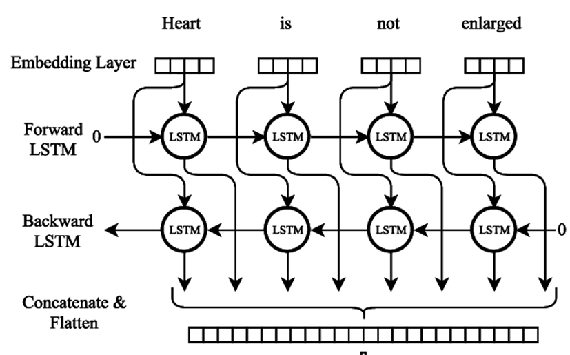

# Medical Specialty Classification using BERT
Repository for medical specialty classification from transcription using BERT as part of RADI 623: Natural Language Processing. Explore the notebook in 'src\specialty_classification.ipynb' for the code. The code was written in Pytorch. 

## Note
- The trained model is too large for github. You can download the checkpoint via [google drive](https://drive.google.com/drive/folders/1NM78-nTTuuaP57IL1Pequwz_cNzy-pI1?usp=sharing).
- The data folder is used to store mtsamples.csv. THe image folder is used to store figures. The model fodler is used to stored checkpoint and results dictionary in pickle. The src folder contain all the source code and the notebook.
- The notebook utilize various modules for the pipeline. The codes, including the training loop, were modified from the 
[Zero to Mastery Learn PyTorch for Deep Learning course](www.learnpytorch.io).
- Torch version 2.0 and torchvision version 0.15 were used. However, torch version >= 1.12.0 should be enough.
- The cells for training is included in the notebook. However, they have been commented out and the training has already been completed. The models were saved in model folder, which will be loaded for evalaution of the test set in the other section. 
- Seeds were set at various steps with the set_custom_seed module.

# Experiment Overview

The experiment consist of the following steps:
- Data analysis. The data will be checked for null. The class distribution will be analysed and appropiate measure to deduplicate and transform the data to be multi-class data will be performed. Corpus statistic such as vocab size and token length would be analysed.
- For data preprocessing, during class distribution analysis, the class will be encoded. The data will then be splitted into train/val/test set. The transcription will then be tokenized before feeding into the model. The tokenization is handled by the transformer libraly automatically which consist of tokenizing, padding/truncation, special token addition, creation of attention_mask and segmentation_id which is the format required for BERT model. The preprocssing (after train/val/test splitting) is done sequentially by the data_setup custom module which is used to create custom dataset and custom data loader.
- The train/val loop automatically collect training statistic, plot it, save the model with the least loss and the relevant figures. Then the next section load the trained model from the checkpoint and perform evalaution on the test set and save the results.

# Model 1: BERT_LSTM_base
The first model use BERT to get the embedding before passing it to LSTM. Using the embedding of all token in BERT and passing it to LSTM should allow for more information to be extracted as opposed to just using [CLS] token embedding alone and feed it to dense layer (see good figure explanation for the output of BERT in this [website](https://towardsdatascience.com/text-classification-with-bert-in-pytorch-887965e5820f) if forget in the future). Nevertheless, this might not always be the case as seen in the experiment by [Adam for the CS224n: Natural Language Processing with Deep Learning Stanford / Winter 2019 course](https://web.stanford.edu/class/archive/cs/cs224n/cs224n.1194/reports/default/15718571.pdf) where BERT + LSTM actually resulted in a drop of performance compared to just using BERT on the Stanford Question Answering Dataset (SQuAD).

The main limitations which is apparent before training were:
- Tokenizer inadequately tokenize medical terms
- 512 token limits which limit the information gained from the transciption.  

## Results 
- Inference time for all test sample (cuda): 3.66 seconds  
- Number of all sample: 230 samples 
- Inference time for one sample (cuda): 0.02 seconds 
- Accuracy: 0.52 
- Balanced accuracy: 0.44 
- ROC AUC (Macro - OVO): 0.91 
- Precision (Macro): 0.42 
- Recall (Macro): 0.44 
- F1 (Macro): 0.41 
- For confusion matrix of the test set, please see the svg file in: image\BERT_LSTM_base_best_epoch_107_test_confusion.svg

I will be looking at F1 macro score as all the classe should be treated equally regardless of the sample presented. A score of 0.41 in this case means the model still is not practical and will likely send the patient to the wrong specialties. This poor performance might be due to the limitation of BERT since it is trained with 512 token only due to quadratic increase in computational cost of larger context length [(Devlin j, 2018)](https://arxiv.org/abs/1810.04805). This obviously fails to capture the entire context of the corpus. Even though we can make BERT accept longer input, the model has not been trained with that and as such the embedding of token > 512 would be ill-defined and likely fail to capture the meaning of the words. Note that this is not 512 words but 512 token, including special tokens so the amount of words capture by BERT is actually < 510. There are many strategies to work around this limitation for long document, including propcessing text in chunk and aggregating the classifiers.

# Model 2: BERT_LSTM_truncate_from_left
[(Sun C, 2020)](https://arxiv.org/pdf/1905.05583.pdf) examined various strategy for fine-tuning BERT. One of the element tested was truncation strategy. They found that for IMDb dataset, for simple truncation, truncation from left (keep the last 510 tokens) performed better than truncation from right (keep the first 510 tokens). This suggested that more information is stored in IMDb dataset in the tail rather in the head. Perhaps the same is true in this medical transciption dataset. 

The difference between model 2 and model 1 is the tokenizer, which in this model has been the truncation_side has been set to 'left'.

## Results 
- Inference time for all test sample (cuda): 3.83 seconds
- Number of all sample: 230 samples
- Inference time for one sample (cuda): 0.02 seconds
- Accuracy: 0.50
- Balanced accuracy: 0.37
- ROC AUC (Macro - OVO): 0.90
- Precision (Macro): 0.35
- Recall (Macro): 0.37
- F1 (Macro): 0.35
- For confusion matrix of the test set, please see the svg file in: image\BERT_LSTM_truncate_left_best_epoch_144_test_confusion.svg

Trancation from left resulted in substantially worse performance. Perhaps Most of the information is at the head of the transcription. Nevertheless, from the loss curve, it would appear that training longer might still be beneficial but I limit myself to 150 epoch in this case.

# Model 3: BERT_bidirectional_LSTM
The LSTM used in the last 2 models was unidirectional. In [2005, Graves](https://www.cs.toronto.edu/~graves/ijcnn_2005.pdf) presented bidirectional LSTM (BLSTM) network. In contrast to unidirectional LSTM, bidirectional LSTM process the sequence in two direction, forward and backward, allowing the model to capture information from both the past and present. As noted by the author, this seems to violate casuality but the behavior is much like how we, human, analyse information. When we are reading, information presented in the current, or next, passage can helps elucidate previous information from the previous passage. In practice, this effectively double the amount of hidden neuron of the LSTM. BLSTM beat LSTM in the phenome classification task from audio in the TIMIT database by 3% in the paper.  

Since in our last experiment, trauncation from left did not yield good results, we revert to default truncation. Setting bidirection = True multiplies the hidden unit by 2. The total params is also increased.

## Results 
- Inference time for all test sample (cuda): 4.65 seconds
- Number of all sample: 230 samples
- Inference time for one sample (cuda): 0.02 seconds
- Accuracy: 0.52
- Balanced accuracy: 0.44
- ROC AUC (Macro - OVO): 0.91
- Precision (Macro): 0.45
- Recall (Macro): 0.44
- F1 (Macro): 0.43
- For confusion matrix of the test set, please see the svg file in: image\BERT_LSTM_bidirectional_best_epoch_148_test_confusion.svg

Using BLSTM did improve our F1 by around 2% with little increase in inference time. Nevertheless, the result still is not good enough for practical use. Sending a patient to the wrong specialty could mean a huge waste of time and potentially can cause death. I would pernally accept F1 of > 90% for this system to be used. Also, from looking at the confusion matrix for all model, minority classes such as bariatrics, dentristry or even the group "other" have not been correctly classified at all which might be the problem of the corpus itself as it has too little data for those classes. The bottle neck limitation could come from the tokenizer, which is not intended for medical corpus, the base BERT, which has not been pre-trained on medical data and the quality of the corpus itself (tool ittle data for some classes).

To further improve performance, here are some strategies for future experiment:
- Further group minority classes into one class during preprocessing.
- Custom tokenizer to correctly tokenize the word.
- Use other BERT model which has been pre-trained on domain-specific task such as [PubmedBERT](https://arxiv.org/pdf/2007.15779.pdf).
- Unfreeze more layer during training to allow for fine-tuning.
- Try other truncation study such as middle, head+tail or hierarchical.
- Utilize other tranformer-based model which allow for longer context length such as [Longformer](https://arxiv.org/pdf/2004.05150.pdf) which support up to 4,096 tokens.

